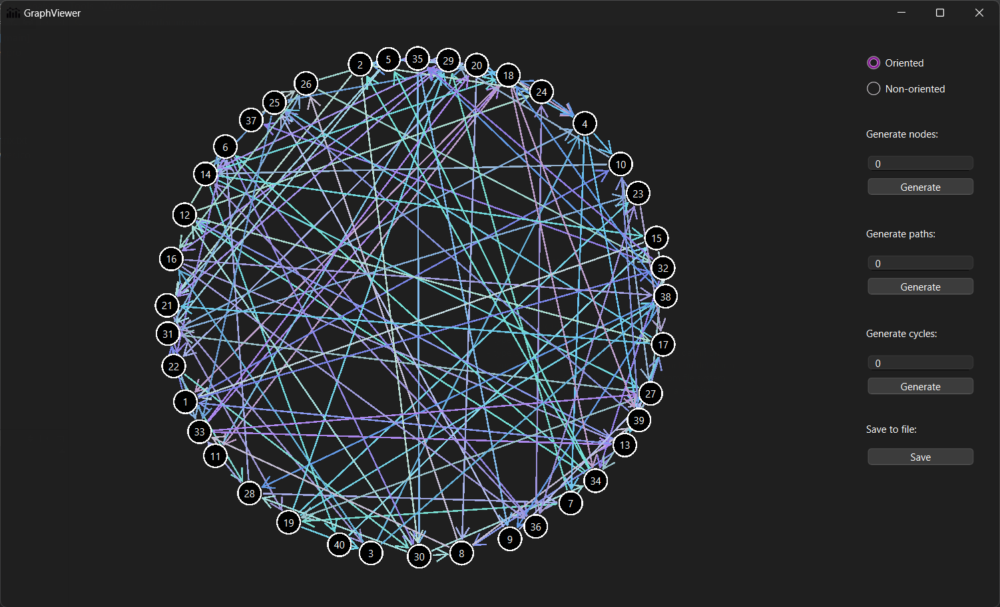

# GraphViewer



**GraphViewer** is a C++ project using the Qt framework for visualizing and manipulating graphs. This tool allows users to add nodes, create paths and cycles, move nodes around, and view the graph as either directed or undirected. Users can also save graph details, including an adjacency matrix, paths, cycles, and an adjacency list, into a text file.

[Video presentation](presentation.mp4)

## Features

- **Add Nodes**: Create and add nodes to the graph.
- **Create Paths**: Manually or automatically generate paths between nodes.
- **Create Cycles**: Identify and create cycles within the graph.
- **Move Nodes**: Drag and position nodes within the graph.
- **Graph Display**: Toggle between viewing the graph as directed or undirected.
- **Save Graph Details**: Export graph details such as node count, adjacency matrix, paths, cycles, and adjacency list into a text file.

### Example Graph Details File (`AboutMatrix.txt`)

```
Nodes count: 5

Adjacency matrix:
0 1 0 0 0
0 0 0 0 1
0 0 0 1 0
1 0 0 0 0
0 0 1 0 0

Paths:

Cycles:
2, 5, 3, 4, 1, 2

Adjacency list:
1: 2,
2: 5,
3: 4,
4: 1,
5: 3,
```

## Prerequisites

- **Qt Framework**: Ensure you have the Qt framework installed to compile and run the project.

## Usage

1. **Clone the Repository**:
   Clone this repository to your local machine using the following command:

```bash
git clone https://github.com/tbtiberiu/GraphViewer.git
```

2. **Open in Qt Creator:**
   Open the `GraphViewer.pro` file in Qt Creator.

3. **Set Working Directory:**
   
   Set the project working directory to `<ProjectLocation>/GraphViewer`.

4. **Build the Project:**
   Compile the project using Qt Creator's build system. (`CTRL` + `B` on Windows by default)

5. **Run the Application:**
   Execute the project within Qt Creator. (`CTRL` + `R` on Windows by default)
